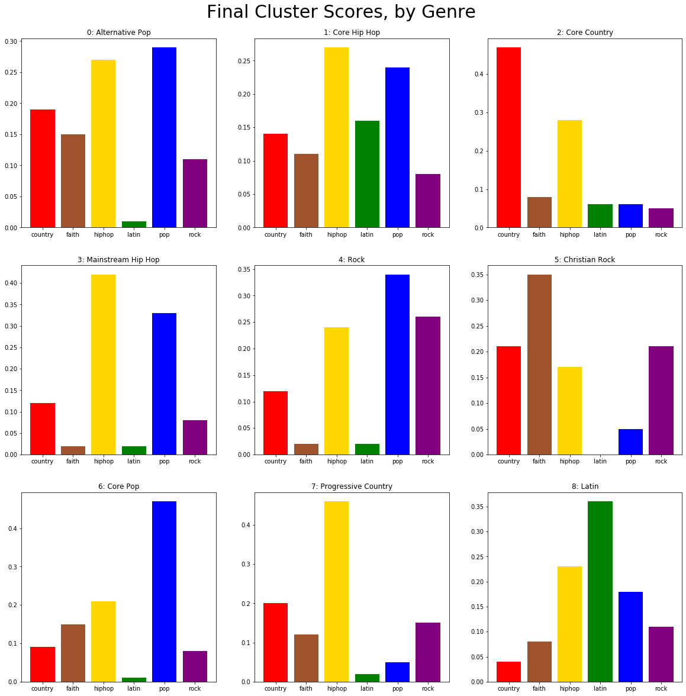

# Unsupervised clustering for Tour Route Planning
## Using data Billboard, Songkick, and Spotify

**Author**: Kevin Giroux

The contents of this repository detail an analysis of my capstone project. This analysis is detailed in hopes of making the work accessible and replicable.


### Introduction and Business problem:

For any developing musical artist, building an engaged following is the key to growing your career.  
Today, in the age of social media, it is easier than ever for a musician to build a global fanbase online.  

Social media fans can be transient, though, and the reality is it is less clear than ever where to start 
when it comes to organically building a local and regional fanbase from the ground-up, especially for 
artists on a limited budget.

Example:
“If I can only afford to hit 3 cities on my next tour, where should I perform between Memphis, Albuquerque, 
Grand Rapids, Cleveland, Tampa, or Milwaukee?”

Primary analysis goals:
- Classify a set of 3rd- and 4th-tier US cities by their taste for various musical genres
- Use the results to define genre “archetypes" for each set of cities that artists can reference when planning their live tour routes
- Derive insights about which genres are well-received in a given city AND which genres are not well-received
- Come up with as equal-sized clusters as possible, so that each cluster will contain a set of multiple recommended cities for touring through


### Data
I acquired data for this project through a combination of web scraping and API access, with data coming from 3 sources:
1. Billboard.com:  
    Scraped the weekly Top Emerging Artists list for the names of the top developing artists across all genres between January 2018 and March 2020
2. Spotify API:
    Enriched artist list with the associated genre(s) of each artist
3. Songkick API:
    - Pulled each artist’s full historical “gigography" (list of live performance events) between January 2018 and March 2020 using Songkick’s API
    - Each event object included the city and state of the event as well as a popularity score for the event

These activities resulted in a dataset of 218 artists and 14,659 associated events.

The final dataset included the following zip codes:  33308, 33312, 33304, 33301, 33316, 33305, 33315, and 33306, and includes average monthly prices from 2012-01 through 2018-04.


## Methodology
1. Manual genre mapping
    - Spotify's API provided associated genre data for every artist in my dataset, but this data frequently came as of a list of strings of multiple sub-genres
    - I manually categorized each artist into one of six macro-genre categories:  Pop, Hip hop, Country, Latin, Faith, and Rock
        - In some cases the macro-genre category was clear; for example Lil Xan has the associated genres ["emo rap", "underground hip hop", and "vapor trap"] -- clearly hip hop.
        - In other cases it was vague; for example many artists had the genres "country pop" or "pop rap"
        - It is due to these vague cases that I decided manual genre assignment would work better than automation for this task
2. Data cleaning
    - Examined final artist list and removed any non fulltime musical artists (e.g. one of the artists was a local choir that had gone viral due to a television appearance, leading to their charting on Billboard)
    - Filtered out all events associated with non-US cities; 925 US cities were represented by at least one event each in the resulting dataset (way too many for clustering)
    - Filtering data at the city level, by each city's associated event count
        - Filtered out any cities that had less than 30 associated events included, due to small sample size
        - Filtered out any cities that had more than 125 associated events, as these cities were too mainstream (e.g. NYC, Chicago, LA)
    - Filtered out duplicate cities that had the same city name, but were referring to cities in two different states (e.g. Springfield, IL and Springfield, NJ)
    - Ending data structure:  a list of 3111 events, tagged by city and macro-genre, with an associated popularity score (as pulled from Songkick's API)
3. Data structuring
    - Grouped data by city and macro-genre
    - Within each city, averaged the popularity scores for all events of each genre type to wind up with an average popularity score for each genre in each city
    - Pivoted the dataframe to create an individual row for each city, with six columns containing the average popularity score for each genre
        - Ending data structure:  52 rows (one for each city), with 6 columns containing each city's average popularity score for each of the six macro-genres
    - Normalization
        - To avoid city-size, as reflected in the raw popularity scores for each city (i.e. smaller cities having inherentlylower popularity scores), being taken 
        into account by the clustering algorithm, I normalized the data in multiple ways
            - By each row's maximum value
            - By each column's maximum value
            - By the sum of all 6 average genre scores for each row
4. Model fitting and tuning
    - K Means:
        - Fitted unsupervised K Means clustering algorithms to the unnormalized data and all three different versions of the normalized data
        - For each of the 4 versions of the dataset, K Means algorithm was fitted for clusters of all values between 3 and 15, to identify the optimal number of clusters 
        for each version of the dataset
        - Calinski Harabasz scores and Within Cluster Sum of Squares scores were used to determine the optimal number of clusters for each version of the dataset
        - CONCLUSION: The 4 versions of the dataset were optimized at between 9 and 13 clusters, respectively
        - CONCLUSION: The unnormalized and normalized by row-sum datasets resulted in the the lowest number of clusters, optimally, so I focused on these datasets for the rest of the analysis
    - Heirarchical Agglomerative Clustering:
        - Fitted 3 instances of an HAC clustering algorithm to both the unnormalized and normalized by row-sum datasets, resulting in 6 models for comparison
            - Each instance of the HAC algorithm differed in the linkage computation method, which I set to Ward, Complete, and Average
        - Created dendrograms up to 13 clusters for each of the 6 instances of the HAC algorith, to compare the evenness of resulting cluster sizes and to visually examine the cluster splits 
        just before and just after the optimal number of clusters identified previously using K Means algorithms (i.e. examining the 7th and 8th splits as well as the 11th, 12th, and 13th splits)
        - CONCLUSION: Optimal cluster count is either 9 or 10
        - CONCLUSION: HAC results in the most evenly distributed clusters with the linkage set to either Complete or Ward
        - CONCLUSION: Normalizing by row-sum results in more evenly distributed clusters than does the unnormalized data
    - Final model selection
        - Calinski Harabasz scores and Silhouette scores were used to compare the output from a K Means algorithm, and 2 HAC algorithms with the linkages set to Complete and Ward, respectively
        - Each of these 3 algorithms was run twice, set for both 9 and 10 clusters
        - The resulting sets of six CH scores and six Silhouette scores were used to identify the best model for this particular task
        - CONCLUSION: HAC resulted in more evenly distributed clusters than K-Means
        - CONCLUSION: Among the HAC algorithms, those with the linkage set to Ward always performed better than those with the linkage set to Complete
        - CONCLUSION: Examining the clusters themselves, 9 clusters results in more optimal clustering than 10 clusters for this particular use case.
        - CONCLUSION: THE HAC MODEL, LINKAGE = WARD, SET TO 9 CLUSTERS IS THE WINNING MODEL


## Results

#### Count of cities, by minimum associated event count cutoff

> This chart shows the decreasing sample size as cities with an event count below a given threshold were filtered out of the dataset.

#### Calinksi Harabasz Scores for differing values of K, data normalized by row-sum

> This chart shows that clustering using the dataset normalized by row-sum was optimized at both 9 and 10 clusters.

#### Dendrogram, HAC (Linkage=Ward, 9 clusters)

> A chart of the resulting clusters, with cluster sizes in parantheses, generated by the final-selected model.

#### Silhouette scores, by clustering method

> This chart shows the various scores for each of the 6 candidates for final-selected model.

#### Results 1:  Final cluster scores, by genre

> This chart shows the breakdown of each cluster's various individual genre scores, for comparison across clusters.

#### Results 2: Annotated dendrogram of final results

> Annotated dendrogram of the final clustering results.


## Conclusions:

1. Latin and Faith were the most niche genres
    - Core hip hop (1), and Latin (8) are the only markets with strong popularity scores for Latin
    - Christian rock (5) had the strongest Faith score, more than double the next highest Faith scoring cluster
    - Faith scored moderately well in several additional clusters, whereas Latin did not, making Latin the most niche of our six genre categories
2. Hip hop performs well everywhere
    - Counterintuitively, one of the highest scoring hip hop clusters was the Progressive country (7) cluster
    - This could be interpreted as an indication that hip hop artists trying to grow a fanbase within country listeners should strategize around the cities the Progressive country cluster
3. Rock wasn't a winning genre in any of the clusters
    - In the Rock cluster (4), Pop was actually the winning genre (similar to Hip hop winning in the Progressive country (7) cluster)
    - Identifying this market as "the most rock-leaning" market is what led to its archetype definition of "Rock"
    - See Limitation #1 for more on the challenge of considering both inter- and intra-cluster genre scores when defining each clusters genre archetype


## Limitations & Next Steps

1. Limitations: 
    - Musical genre is a spectrum
        - Clustering along genre lines will always be a qualitative exercise as much as a quantitative exercise
        - The outputs of the various versions of whichever algorith you might be using MUST be interpreted within the context of your particular goal or use case
        - In the case of this exercise, most clusters had multiple genre "winners", so defining cluster archetypes involved inter-cluster AND intra-cluster genre score comparisons
            - One example of how this manifested was in Hip hop's popularity in every market, which was reflected in very strong hip hop scores for each of the 9 clusters
            - Thus, it was more important to look at each cluster's hip hop score in comparison with all the other clusters' hip hop scores, rather than comparing the hip hop score
            with the other genre scores for a single given cluster
    - Manual genre mapping
        - For this proof of concept, I had to manually assign each artist to one of six macrogenres (Pop, Hip hop, Country, Rock, Latin, Faith) based on the set of associated micro-genres
        for each artist that I pulled from the Spotify API
        - Many artists had associated genres such as "Pop rap" or "Country pop", which would have made it challenging to automate this assignment task
    - Popularity score
        - Songkick's API documentation doesn't provide a technical definition for the 'popularity' attribute for each of the live events I pulled from their API
        - In future versions of this model, the popularity metric could be replaced by a more clearly defined financial metric (such as ticket sales revenue, or % of total available tickets sold)

2. Future work:  
- Create a front-end that allows users to run the analysis based on a pool of comparable musical acts of their choosing
- Automate the assignment of higher order genre categories to each artist based on Spotify's micro-genre data
- Perform the same analysis, but within a single higher order genre category, such as Hip Hop
    - This would mitigate the need for macro-genre assignment, as Spotify's micro genres could be used for the different genre categories
    - This analysis might result in more intuitive clusterings as far as which cities fall into which buckets
- Perform the same analysis using international cities instead of domestic cities

### For further information
Please review the narrative of our analysis in [our jupyter notebook](./student.ipynb) or review our [presentation](./presentation.pdf)

For any additional questions, please contact **kevinsgiroux@gmail.com)


##### Repository Structure:

├── README.md                 <- The top-level README for reviewers of this project
├── student.ipynb             <- narrative documentation of analysis in jupyter notebook
├── presentation.pdf          <- pdf version of project presentation
├── data_v2                   <- raw data files
├── archive                   <- an initial version of this analysis using only web-scraped data, along with all the scraped data files
├── images                    <- image files for visualizations included in README document

```
